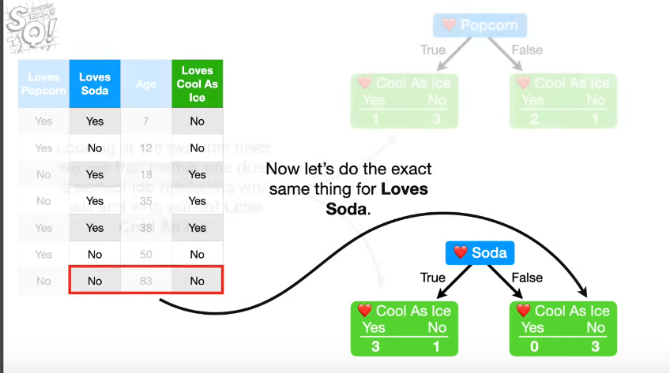
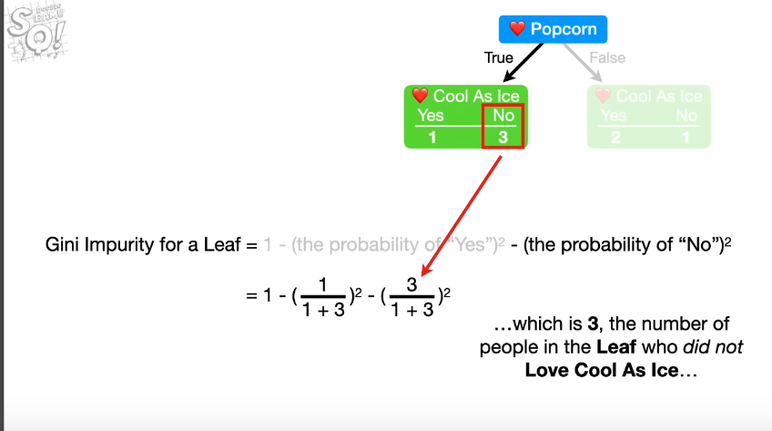
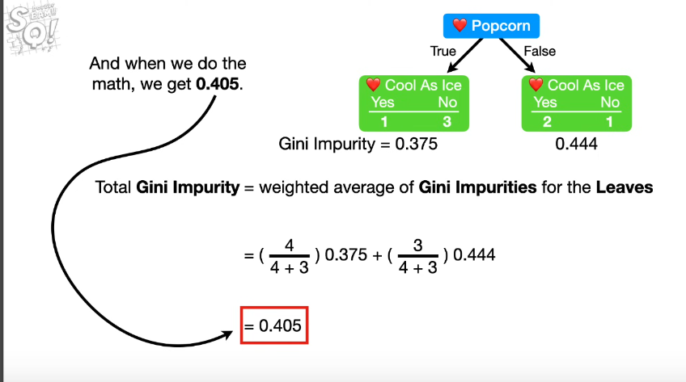
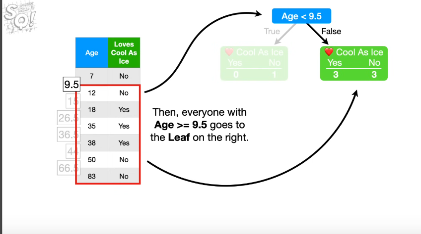
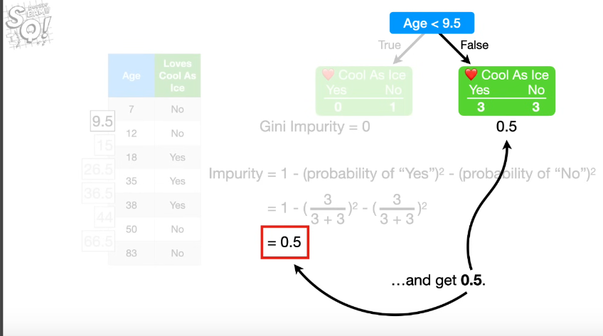
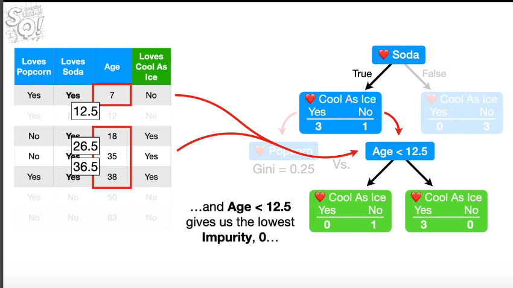
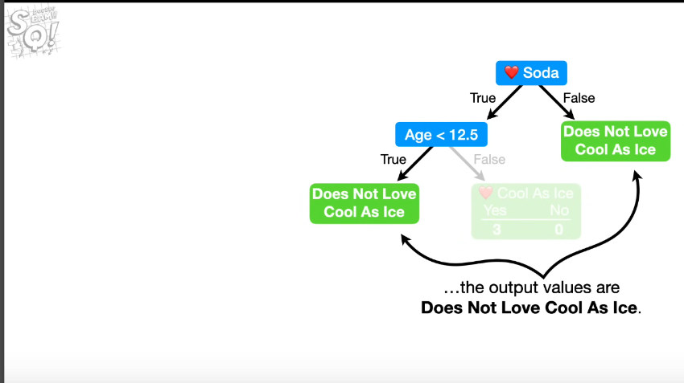
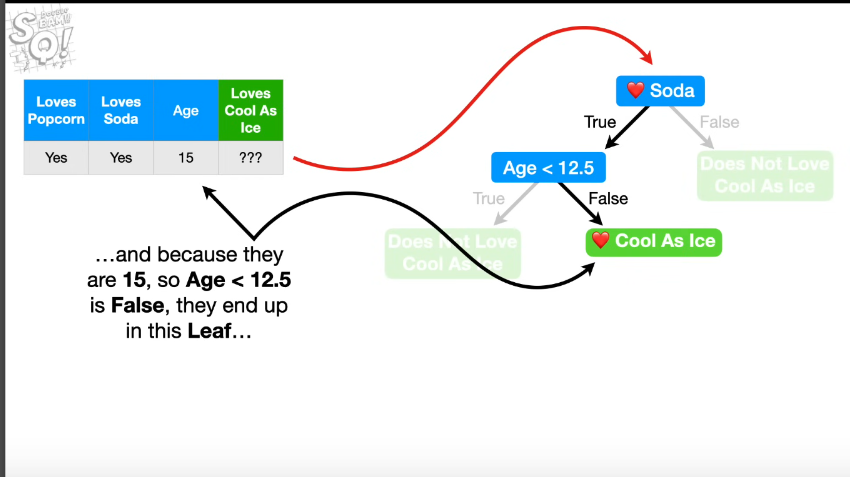

Decision tree makes statement, and makes decision.
Combine numeric data and yes or not data.
The very top of the tree is called the **Root node**.
Just at the bottom, it's call **Internal Nodes** or **Branches**.
At end, its's called **Leaf Nodes** or just **Leaves**.

## Building

The first step si to know which feature will be at the Root Node.

We iterate on features, start with simple decision tree. We take on feature at the top, we create an Internal nodes and count decision under this.

In fact, we start to predict one feature, and start with random Root Node to know if we have pure (impure leaf is branche who are true and false, pure when they are only one answer).
After that, we can compute **Gini Impurity** or **Entropy and Information Gain** of each leafs.
To compute Gini Impurity, we start by calculating this kpi for individual Leaves (nodes).

If leafs do not represent the same number of people, the total Gini impurity is equal to weighted average of Gini impurities for the Leaves.

To calculate the weight, we take the total individus of the individual node, take it to numerator. And at the bottom of fraction, we take the alls length of populations. We multiplies by Gini Impurity by nodes and have total impurities for the leaves.

We calculated Gini Impurity with other Root Nodes.

### Gini impurity with numerical values

1) For numerical value, we start by sort features from the bottom.
2) Calculate the average Age for all adjecent people.
3) Calculate Gini Impurity for each average age.

At the first leaf, we have only one representation, so gini impurity will set at 0.

The total impurity from the leaf will be :

`(1 / (1 + 6)) * 0 + (6 / (1 + 6)) * 0.5 = 0.429`

Boucle on each average adjecent feature. Take the lowest Impurity score. If two impurity score are same, we can pick ethier one.

We are calculating fetures Gini impurty values (not the target) and see results on target.

We compare all impurity values and takes the lowest, for exemple, 0.405, 0.214, 0.343 => 0.214.

So we can take 0.214 feature at the Root Nodes.

Now we can calculate Leafs node with features node.

At this step, we have to think about splitting nodes to an other Leaf nodes. This node is impure so we can try to split to see if we can reduce impurity. Let's calculate.

(Remember two ways to calculate impurity scores)

For exemple, Age lesser than 12.5 gives two Leaves pur, this kpi is fixe to 0. Left Leaf nodes was 0.25, we take the right one. We considere **Leaves** Because they are no reason to continues the splitting (0 score).

When all Leafs are pur (considere Leaves), we need to assign output values for each Leaf.

Here we take two's once because the majority of Leaves has much "No" vote on Coll as Ice.

For exemple, the right one attribute "Yes" Cool As Ice (bigger one).

To predict new data with this tree, we just have to dive in tree to get result

The Decision Tree's model problems si Overfitting, beacause, his decisions was make with strict classification data's train. Test data can be totaly wrong.