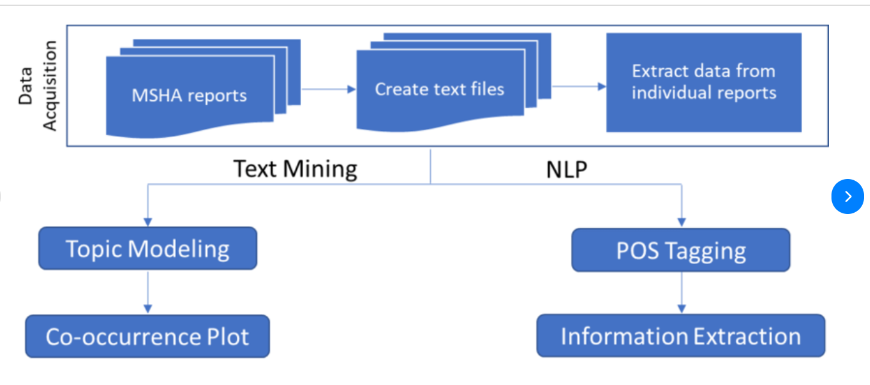
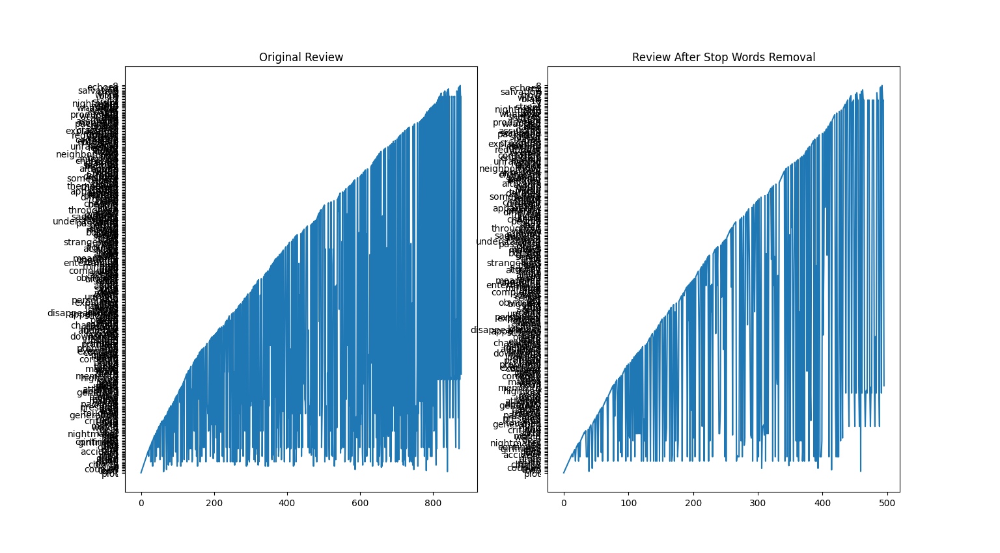
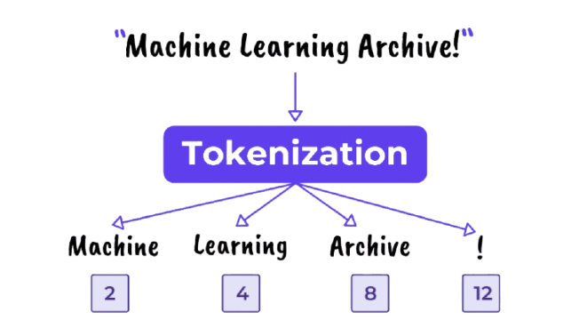
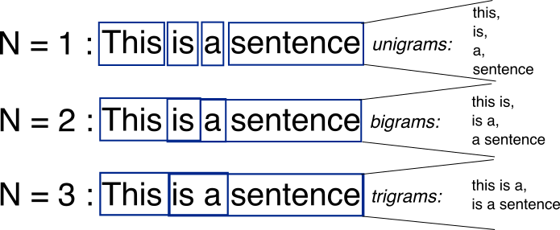

### Introduction

Le NLP (traitement automatique du langage naturel) est une boîte à outils en intelligence artificielle dédiée au traitement du langage. Il combine l’apprentissage automatique, les statistiques et les connaissances linguistiques.

Il existe deux grands types d’usage :

    - La compréhension du langage naturel (NLU)

    - La génération de langage naturel (NLG)

Le NLP permet de réaliser des tâches comme :

- l’analyse de sentiment,

- la classification de texte,

- les chatbots et assistants virtuels,

- l’extraction d’informations,

- la traduction,

- le résumé automatique,

- la reconnaissance vocale

- la correction automatique.

Le Text Mining (exploration de texte) et le Text Analysis (analyse de texte) sont deux approches principales pour construire ces types de projets.

L’analyse de texte consiste à extraire des informations et des connaissances à partir de texte en utilisant l’IA et les techniques de NLP. Ces techniques transforment les données non structurées en données structurées, ce qui facilite le travail des data scientists et analystes.

### Q1) Text mining vs NLP

Le Text Mining et le NLP partagent un objectif commun : tirer du sens à partir de données textuelles. Tous deux s’appuient sur des techniques comme la tokenisation, l’analyse syntaxique, l’extraction d’entités ou encore la classification de texte. Ils utilisent les mêmes algorithmes (machine learning, deep learning) et manipulent les mêmes types de données (texte non structuré). En résumé, le Text Mining dépend fortement du NLP pour fonctionner efficacement, et ils sont souvent utilisés ensemble dans les projets d’analyse de texte.

Le NLP est l’ensemble des techniques permettant aux machines de comprendre et manipuler le langage humain, tandis que le Text Mining est l’application concrète de ces techniques pour extraire de l’information utile à partir de grands volumes de texte. En d’autres termes, le NLP fournit les outils (comme la reconnaissance d’entités, la lemmatisation, etc.), et le Text Mining les utilise pour analyser, explorer et structurer les données textuelles dans un but précis, comme la prise de décision ou la détection de tendances.

- Text Mining : 

<ins>Objectif </ins> : Explorer les textes pour identifier des patterns globaux.

Topic Modeling
→ Identifier automatiquement les thèmes ou sujets récurrents dans les textes (ex : sécurité, ventilation, accident...).

Co-occurrence Plot
→ Visualisation des cooccurrences de mots : quels mots apparaissent fréquemment ensemble ?
Cela donne une idée des associations sémantiques dans le corpus.

Le Text Mining aide à explorer, structurer et résumer de grandes quantités de texte sans forcément chercher à "comprendre le sens" aussi finement que le NLP.

- Nlp :

<ins>Objectif</ins> : Comprendre la structure linguistique du texte.

POS Tagging (Part-of-Speech Tagging)
→ Étiqueter chaque mot selon sa fonction grammaticale : nom, verbe, adjectif, etc.

Information Extraction
→ Extraire des entités précises (personnes, lieux, dates, types d’événements…) ou relations entre ces entités.
C’est une étape avancée, qui utilise le POS Tagging et d’autres analyses syntaxiques.

Le NLP permet une compréhension fine du texte pour en tirer des informations ciblées.

### Q2) NLP & Sous-domaines

- Analyse de sentiments (Sentiment Analysis)

<ins>Objectif</ins> : Déterminer l’émotion ou l’opinion exprimée dans un texte (positive, négative, neutre).

<ins>Exemple</ins> : “Le service était vraiment excellent, je reviendrai sans hésiter !”

→ Le modèle de NLP attribuera un score positif à cette phrase.
Cela peut être utilisé pour analyser des milliers d’avis et savoir si un produit ou un service est bien perçu.

<ins>Cas d’usage</ins> :
Analyser les commentaires clients
Suivre la réputation d’une marque sur les réseaux sociaux, filtrer des feedbacks négatifs automatiquement

- Reconnaissance d’entités nommées (Named Entity Recognition, NER)

<ins>Objectif</ins> : Identifier et extraire des entités importantes dans un texte, comme des noms de personnes, lieux, organisations, dates, montants, etc.

<ins>Exemple</ins> : “Emmanuel Macron a rencontré Elon Musk à Paris le 15 juin 2023.”

→ NER détecte :
Emmanuel Macron → Personne

Elon Musk → Personne

Paris → Lieu

15 juin 2023 → Date

<ins>Cas d’usage</ins> :

Extraire automatiquement les faits clés d’un article de presse

Alimenter une base de données avec des noms détectés dans des documents

Faire de la veille informationnelle en détectant des noms importants dans des flux d’actualité

- Étiquetage grammatical (Part-of-Speech Tagging, POS Tagging)

<ins>Objectif</ins> : Attribuer une catégorie grammaticale à chaque mot (nom, verbe, adjectif, etc.).

Exemple : “Les enfants jouent dans le parc.”

→ Résultat POS :

Les → déterminant

enfants → nom

jouent → verbe

dans → préposition

le → déterminant

parc → nom

<ins>Cas d’usage</ins> :

Faciliter la traduction automatique

Améliorer la lemmatisation en connaissant le rôle du mot

Préparer des textes pour l’analyse syntaxique ou sémantique

### Q3) Uses cases

Le NLP permet de réaliser des tâches comme :

l’analyse de sentiment,

la classification de texte,

les chatbots et assistants virtuels,

l’extraction d’informations,

la traduction,

le résumé automatique,

la reconnaissance vocale

la correction automatique.

Un cas avancé pourrait-être de faire une classification de document en fonction du vocabulaire pour envoyer à l'équipe dédié. Par exemple, un demande de remboursement, -> équipe Sales. Un problème informatique, -> support technique …

### Q4 : Qu’est-ce qu’un stop-word ? Pourquoi est-il important de supprimer les stop-words ?

En recherche d'information, un stop-word (ou mot vide) est un mot tellement courant qu'il apporte peu ou pas d'information sémantique utile. Il est donc souvent inutile de l’indexer ou de le prendre en compte dans une recherche.  
En français, des mots vides typiques sont par exemple : « le », « la », « de », « du », « ce ».

***Exemple :***  

**Version non nettoyée :**  
« Je suis allé à la bibliothèque avec mon frère, mais il n'y avait pas de livres intéressants. »

**Stop-words extraits :**  
je, suis, à, la, avec, mon, mais, il, n', y, avait, de

**Version nettoyée (sans stop-words) :**  
« allé bibliothèque frère, livres intéressants. »

Ce traitement est typique dans le prétraitement NLP (traitement automatique du langage naturel) : il permet de se concentrer sur les mots clés qui portent réellement le sens du texte.
  
***Impact avec et sans stop word :***  

### Q5 : En plus de la ponctuation, on retrouve souvent des caractères spéciaux au sein de données textuelles. Comment sont traités ces deux types de caractères ?

En traitement de texte, la ponctuation et les caractères spéciaux peuvent nuire à l’analyse automatique. Ils compliquent la séparation correcte des mots (tokenisation) et ajoutent du bruit dans les données, ce qui gêne la compréhension par les machines.

Ces éléments n'ont généralement pas de valeur sémantique importante, c’est pourquoi ils sont souvent supprimés ou normalisés lors du prétraitement. Cela permet d’obtenir un texte plus propre, facilitant les tâches comme l’analyse de sentiment ou la classification.

**Caractères spéciaux et de ponctuation qui sont souvent supprimés :**  
| # ‘“ , .% & ^*! @ ( ) _ = – [ ]$ > \ { } ` ~; : / ? <

***Exemple :***  

**Version non nettoyée :**  
"Salut !!! Tu vas bien ? Moi ça va 😊. On se voit @18h30 – n'oublie pas 😉 #rdv"

**Étapes de traitement :**  

    - Suppression de la ponctuation excessive (!!!, ?, ., –, ’, etc.)

    - Suppression des emojis (😊, 😉)

    - Suppression des caractères spéciaux / hashtags / mentions (@, #)

    - Nettoyage des contractions ou symboles non standards 

**Version nettoyée (sans ponctation et caractères spéciaux):**  
"Salut Tu vas bien Moi ça va On se voit 18h30 n'oublie pas rdv"

### Q6 : Qu’est ce qu’un token ? un N-gram ? Quel processus permet-il de les obtenir ?

Un token est une unité de base d’un texte après découpage, souvent un mot, mais cela peut aussi être un sous-mot ou un caractère selon le contexte.
Un N-gram est une séquence de n tokens consécutifs. Par exemple, un bigramme (2-gram) contient deux mots consécutifs, un trigramme en contient trois, etc.

Ces éléments sont obtenus par un processus appelé tokenisation. C’est une étape du prétraitement en NLP qui découpe le texte brut en unités exploitables par les algorithmes.

***Exemple Token :***  

**Texte brut :**  
"Les chats dorment souvent au soleil."

**Après tokenisation (tokens) :**  
["Les", "chats", "dorment", "souvent", "au", "soleil"]

***Exemples N-gram :***  

**Bigrams (2-grams) :**  
["Les chats", "chats dorment", "dorment souvent", "souvent au", "au soleil"]

**Trigrams (3-grams) :**  
["Les chats dorment", "chats dorment souvent", "dorment souvent au", "souvent au soleil"]

Ce découpage permet aux modèles de mieux comprendre le contexte et les relations entre les mots dans une phrase.

### Q7) Stemming & Lemmatization
Une fois l'étape de tokenisation effectué, il faut commencer l'analyse profond du texte.

- Stemming

Consisite à prendre la <b>racine</b> du mot, en supprimant les sufixes et affixes. Par exemple, les mots "programmation", "programmeur" et "programmes" peuvent être «transformés» en <b> programme</b>.

    Limite : Peut trop "généralisé" un mot, par exemple univers et université n'ont pas relations directes.

- Lemmatization

Consiste à analyser le mot dans son <b>contexte grammatical</b> pour le ramener à sa forme de base correcte.
Par exemple, "meilleur" sera associé à "bon", car c’est sa forme de base en tant qu’adjectif. L'entrainement peut-être plus long car l'analyse est plus poussé que celle du Steamming mais apporte des meilleurs résultats.

    Avantage : plus précis que le stemming, car il comprend la nature grammaticale du mot

En conclusion, la technique du Stemming est plus rapide mais n'a pas de compréhension du contexte alors que la lemmatization va être plus lente mais avec plus de contexte. L'utilisation de l'une ou de l'autre dépend du projet, une balance entre performance et optimization doit être faite.

### Q8) Bag of word & TF - IDF

Bag of word : Les mots sont des kernels. On peut utiliser cet algorithme dans d'autres domaines comme la génération d'image.
Les uses cases peuvent être de la classification, de la similarité de documents. 

Il prend un corpus de texte, créer un object contenant tous les mots "uniques" dans un document term matrix. Ensuite on attribue des score sur les occurences du termes. On crée ensuite des vecteurs qui compte l'occurence des mots par documents.

Exemple : 
1] I think therefore I am
2] I love learning python
Transformation : 
   I think therefore am love learning python
1] 2   1     1        1   0     0       0
2] 1   0     0        0   1     1       1

Bon : C'est simple, facile et expliquable
Mauvais : perte du sens sémantique, par exemple : New York != NY 
Il ne prend pas en compte la corrélation des mots.
Il ne peut pas comprendre le sens, ex, Python, animal ou machine learning programming language ?
C'est compliqué de comprendre l'ordre des mots avec la term matrix.
Problème de matrice vide, si beaucoup de documents, les matrices vont contenir énormement de 0

Améliorations possibles :

On peut utiliser des n-grams pour plus de contexte.
Text normalization, en utilisant le stamming par exemple, pour réduire le nombre de vocabulaire.

TF-IDF :

Cet algorithme est la version amélioré de BoW, ici, il y a un système de scoring - poid associé à chaque mots.

Tf désigne term frequency, en comptant l'occurence de fois que le mot à été utilisé (key : occurence). Cela permet d'avoir une idée, en fonction des nombres fréquents, du thème ou du sujet.

IDF désigne quand à lui le nombre de fois que le mot figure dans les différents documents. Plus le mot figure dans différents documents, plus le score de ce dernier diminue.

Cela permet de réduire le poid des déterminants (le, la, un …).
---
Sources : 
https://relativeinsight.com/text-mining-vs-nlp/
https://www.youtube.com/watch?v=fLvJ8VdHLA0
https://www.youtube.com/watch?v=pF9wCgUbRtc