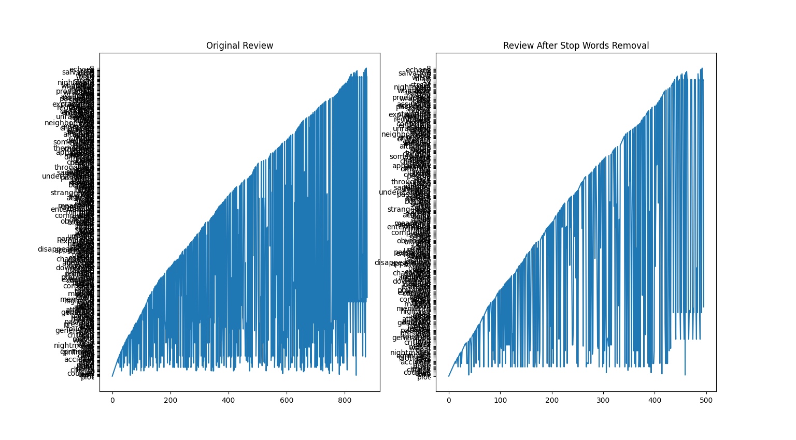
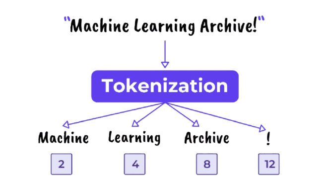

### Q4 : Qu’est-ce qu’un stop-word ? Pourquoi est-il important de supprimer les stop-words ?

En recherche d'information, un stop-word (ou mot vide) est un mot tellement courant qu'il apporte peu ou pas d'information sémantique utile. Il est donc souvent inutile de l’indexer ou de le prendre en compte dans une recherche.  
En français, des mots vides typiques sont par exemple : « le », « la », « de », « du », « ce ».

***Exemple :***  

**Version non nettoyée :**  
« Je suis allé à la bibliothèque avec mon frère, mais il n'y avait pas de livres intéressants. »

**Stop-words extraits :**  
je, suis, à, la, avec, mon, mais, il, n', y, avait, de

**Version nettoyée (sans stop-words) :**  
« allé bibliothèque frère, livres intéressants. »

Ce traitement est typique dans le prétraitement NLP (traitement automatique du langage naturel) : il permet de se concentrer sur les mots clés qui portent réellement le sens du texte.
  
***Impact avec et sans stop word :***  

### Q5 : En plus de la ponctuation, on retrouve souvent des caractères spéciaux au sein de données textuelles. Comment sont traités ces deux types de caractères ?

En traitement de texte, la ponctuation et les caractères spéciaux peuvent nuire à l’analyse automatique. Ils compliquent la séparation correcte des mots (tokenisation) et ajoutent du bruit dans les données, ce qui gêne la compréhension par les machines.

Ces éléments n'ont généralement pas de valeur sémantique importante, c’est pourquoi ils sont souvent supprimés ou normalisés lors du prétraitement. Cela permet d’obtenir un texte plus propre, facilitant les tâches comme l’analyse de sentiment ou la classification.

**Caractères spéciaux et de ponctuation qui sont souvent supprimés :**  
| # ‘“ , .% & ^*! @ ( ) _ = – [ ]$ > \ { } ` ~; : / ? <

***Exemple :***  

**Version non nettoyée :**  
"Salut !!! Tu vas bien ? Moi ça va 😊. On se voit @18h30 – n'oublie pas 😉 #rdv"

**Étapes de traitement :**  

    - Suppression de la ponctuation excessive (!!!, ?, ., –, ’, etc.)

    - Suppression des emojis (😊, 😉)

    - Suppression des caractères spéciaux / hashtags / mentions (@, #)

    - Nettoyage des contractions ou symboles non standards 

**Version nettoyée (sans ponctation et caractères spéciaux):**  
"Salut Tu vas bien Moi ça va On se voit 18h30 n'oublie pas rdv"

### Q6 : Qu’est ce qu’un token ? un N-gram ? Quel processus permet-il de les obtenir ?

Un token est une unité de base d’un texte après découpage, souvent un mot, mais cela peut aussi être un sous-mot ou un caractère selon le contexte.
Un N-gram est une séquence de n tokens consécutifs. Par exemple, un bigramme (2-gram) contient deux mots consécutifs, un trigramme en contient trois, etc.

Ces éléments sont obtenus par un processus appelé tokenisation. C’est une étape du prétraitement en NLP qui découpe le texte brut en unités exploitables par les algorithmes.

***Exemple Token :***  

**Texte brut :**  
"Les chats dorment souvent au soleil."

**Après tokenisation (tokens) :**  
["Les", "chats", "dorment", "souvent", "au", "soleil"]

***Exemples N-gram :***  

**Bigrams (2-grams) :**  
["Les chats", "chats dorment", "dorment souvent", "souvent au", "au soleil"]

**Trigrams (3-grams) :**  
["Les chats dorment", "chats dorment souvent", "dorment souvent au", "souvent au soleil"]

Ce découpage permet aux modèles de mieux comprendre le contexte et les relations entre les mots dans une phrase.

